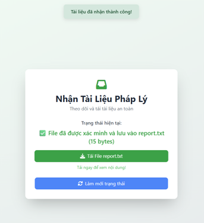

# 📌 Gửi báo cáo công ty qua Server trung gian

Đây là một hệ thống truyền file bảo mật mô phỏng tình huống **gửi báo cáo từ công ty đến đối tác thông qua một server trung gian**. Hệ thống đảm bảo:

- 🔐 **Bảo mật nội dung** bằng thuật toán **AES-GCM**
- 🔑 **Trao đổi khóa AES** bằng **RSA 1024-bit (OAEP)**
- 🧾 **Xác thực người gửi** bằng **chữ ký số RSA/SHA-512**
- 🧩 **Kiểm tra toàn vẹn** bằng **SHA-512**
- 🕒 **Ghi log thời gian giao dịch** tại server trung gian
- 🚫 **Không có kết nối trực tiếp** giữa người gửi và người nhận

---

## 🧩 Kiến trúc hệ thống

```
[Sender] <--> [Server trung gian] <--> [Receiver]
          (chỉ chuyển tiếp + ghi log)
```

---

## 🛠️ Công nghệ sử dụng

- Python 3.10+
- Flask (giao diện web)
- Socket TCP/IP (giao tiếp mạng)
- PyCryptodome (mã hóa AES, RSA, SHA-512)
- Base64, JSON (đóng gói gói tin)

---

## 🚀 Hướng dẫn cài đặt & chạy

### 1. Clone và cài đặt thư viện

```bash
git clone https://github.com/yourusername/report-via-proxy.git
cd report-via-proxy
pip install -r requirements.txt
```

> Hoặc cài từng thư viện:
```bash
pip install flask pycryptodome
```

---

### 2. Tạo khóa RSA cho người gửi & người nhận

```bash
python generate_keys.py
```

Kết quả:
- `sender/sender_private.pem` và `sender_public.pem`
- `receiver/receiver_private.pem` và `receiver_public.pem`

---

### 3. Chạy từng thành phần

**🖧 Server trung gian:**

```bash
python server.py
```

**📥 Receiver (Người nhận):**

```bash
cd receiver
python app_receiver.py
# Giao diện hiển thị tại http://127.0.0.1:5003
```

**📤 Sender (Người gửi):**

```bash
cd sender
python app_sender.py
# Giao diện hiển thị tại http://127.0.0.1:5000
```

---

## 💡 Cách sử dụng

1. Truy cập `http://127.0.0.1:5000`
2. Chọn file `.txt` để gửi (tối đa 10MB)
3. Hệ thống sẽ:
   - Mã hóa nội dung bằng AES-GCM
   - Ký số, tạo metadata, mã hóa session key
   - Gửi gói tin JSON đến server trung gian
4. Receiver nhận, xác minh và phản hồi ACK/NACK
5. Giao diện hiển thị kết quả gửi

---

## 📦 Cấu trúc thư mục

```
├── server.py                 # Server trung gian
├── shared.py                # Hàm mã hóa, ký số, hash, log
├── generate_keys.py         # Sinh khóa RSA
│
├── sender/
│   ├── app_sender.py        # Người gửi (Flask)
│   ├── sender_private.pem
│   └── sender_public.pem
│
├── receiver/
│   ├── app_receiver.py      # Người nhận (Flask)
│   ├── receiver_private.pem
│   └── receiver_public.pem
│
└── static/report.txt        # File nhận thành công
```

---

## ✅ Tính năng chính

- 🔐 Mã hóa nội dung file đảm bảo tính bí mật
- 🧾 Ký số và kiểm tra toàn vẹn chống giả mạo, thay đổi
- 🚫 Giao tiếp gián tiếp qua server trung gian
- 📋 Ghi log chi tiết các lần giao dịch

---

## 📚 Tài liệu tham khảo

1. William Stallings – *Cryptography and Network Security*, Pearson, 2017  
2. NIST SP 800-38D – AES-GCM Documentation  
3. PyCryptodome: https://pycryptodome.readthedocs.io  
4. Flask: https://flask.palletsprojects.com  
5. Python Socket Docs: https://docs.python.org/3/library/socket.html

---

## ✨ Demo ảnh


